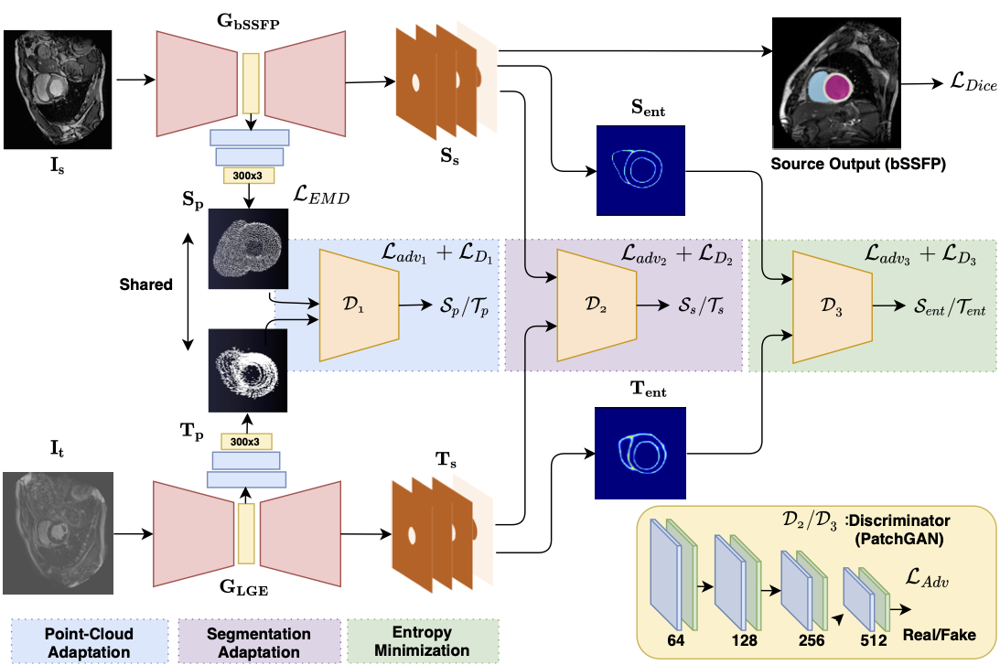

# Adapt Everywhere: Unsupervised Adaptation of Point-Clouds and Entropy Minimisation for Multi-modal Cardiac-MR Segmentation

Pytorch implementation of our method for unsupervised domain adaptation for cardiac-MR using Point-cloud and Entropy manimisation. Based on this implementation, our result achieved state-of-the-art UDA performance for MULTI-SEQUENCE CARDIAC MR SEGMENTATION CHALLENGE, MICCAI-STACOM 2019.

Contact: Sulaiman Vesal (sulaiman dot vesal at fau dot com)



# Abstract

>Deep learning models are sensitive to domain shift phenomena. A model trained on one set of images can't generalise well when tested on images from a different domain or modality, despite imaging similar anatomical structures. It is because the data distribution between the two domains is different. Moreover, creating annotation for every new imaging modality is a tedious and time-consuming task, which also suffers from high inter and intra- observer variability. The recent unsupervised domain adaptation (UDA) methods intend to reduce the gap between source and target domains by using entirely unlabelled target domain data and labelled source domain data. However, current state-of-the-art (SOTA) UDA methods demonstrate degraded performance when there is insufficient data in source and target domains.  In this paper, we propose a UDA method for multi-modal Cardiac Magnetic Resonance (CMR) image segmentation. The proposed method is based on adversarial learning and adapts network features between source and target domain in different spaces. The paper introduces an end-to-end framework that integrates: a) entropy minimisation, b) output feature space alignment and c) novel Point-cloud shape adaptation based on latent features learned by the segmentation model. We validated our method on the publicly available multi-sequence cardiac dataset by adapting from the annotated source domain (3D balanced- Steady-State Free Procession-MRI) to the unannotated target domain (3D Late-gadolinium enhance-MRI). The experimental results highlight that by enforcing adversarial learning in different parts of the network, the proposed method outperforms the SOTA methods in the same setting, and significantly diminishes the data distribution gap.

## Dataset
* Download the STACOM MS-CMRSeg 2019 Dataset: 
      http://stacom2019.cardiacatlas.org/#


## Installation
    Install PyTorch 1.4 + CUDA 10.0 
    Clone this repo.
    
```
git clone https://github.com/sulaimanvesal/PointCloudUDA/
cd PointCloudUDA
```
## Train

    Modify paramter values in ./config_param.json
    Run ./main.py to start the training process

## Evaluate
    Specify the model path and test file path in ./evaluate.py
    Run ./evaluate.py to start the evaluation.


